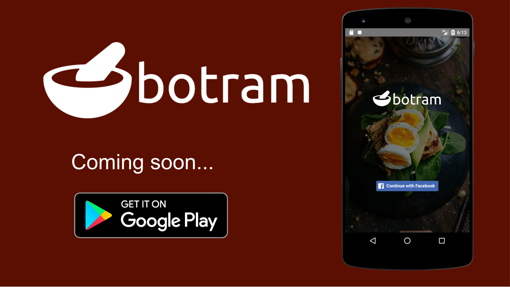

### Announcement

>This is out final project a [HACKTIV8](https://hacktiv8.com/). After we graduated, the server is already takedown, so it cannot be accessed or downloaded, we make this app just for education, for ourself, thank you ^^

### What is Botram ?

Botram is a mobile app for food sharing ! developed by :

  - [sanbastia](https://github.com/sanBastia)
  - [qblol](https://github.com/qblol)
  - [radityaarya](https://github.com/radityaarya)
  - [axiomaswn](https://github.com/axiomaswn)

### Tech

Botram uses a number of open source projects to work properly:

  * [node.js](https://nodejs.org/en/) - evented I/O for the backend
  * [Express](https://expressjs.com/) - fast node.js network app framework !
  * [mongoose](http://mongoosejs.com/) - Awesome mongoose !
  * [mongoDB](https://www.mongodb.com/) - Awesome mongoDB !
  * [React-native](https://facebook.github.io/react-native/) - Awesome future technology by [facebook](http://facebook.com) !
  * [Redux](http://redux.js.org/) - predictable state container for JavaScript apps !
  * [Travis](https://travis-ci.org) - Test and deploy your code with confidence !
  * [Amazon web Services EC2](https://aws.amazon.com/ec2/?nc2=h_m1) - Secure and resizable compute capacity in the cloud.
Launch applications when needed without upfront commitments.
  * [Amazon web Services Elastic Beanstalk](https://aws.amazon.com/elasticbeanstalk/?nc2=h_m1) - Easy to begin, Impossible to outgrow
  * [Amazon web Services S3](https://aws.amazon.com/s3/?nc2=h_m1) - Simple, durable, massively scalable object storage
